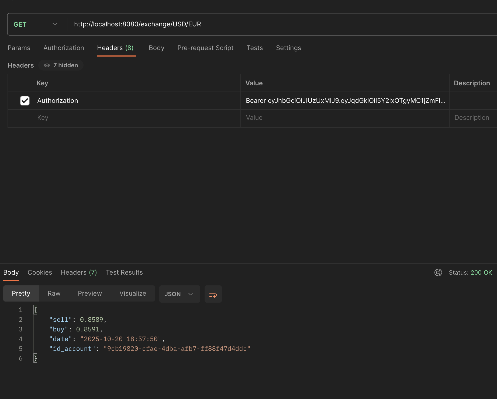
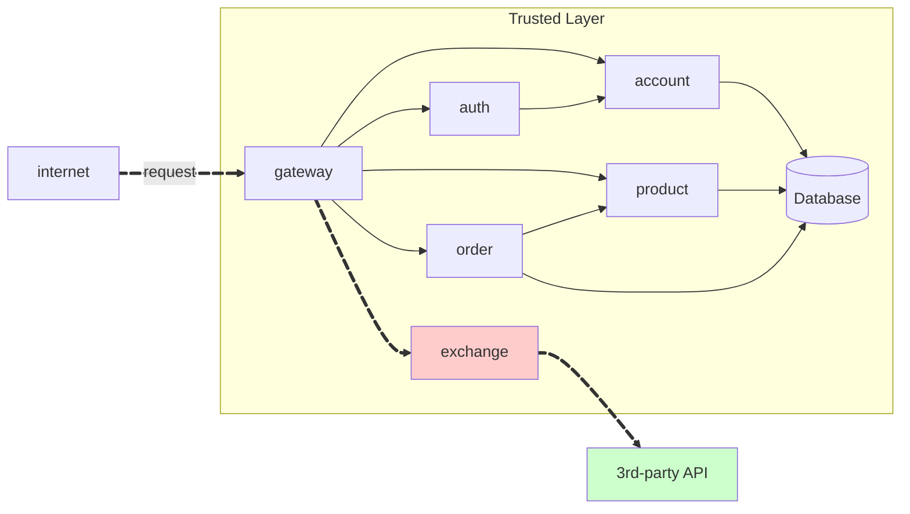

REST API that allows the user to convert between currencies implemented with FastAPI[^1]

- Github repository: [Exchange Service](https://github.com/Joao-Gabriel05/exchange-service)

!!! info "GET /exchange-rate/{from}/{to}"

    Get the current of a coin from one currency to another. E.g. `GET /coin/USD/EUR`.

    === "Response"

        ``` { .json .copy .select linenums='1' }
        {
            "sell": 0.8589,
            "buy": 0.8591,
            "date": "2025-10-20 18:57:50",
            "id_account": "9cb19820-cfae-4dba-afb7-ff88f47d4ddc"
        }
        ```
        ```bash
        Response code: 200 (ok)
        ```
    
    === "Postman"
        { width=100% }

This API uses the [ExchangeRate-API](https://www.exchangerate-api.com/) to get the current exchange rates between currencies.

!!! warning "Attention"

    **To consume the API, the user must be authenticated.**

!!! info "Gateway"

    **This API is consumed through the Gateway of the platform.**


> This MkDocs was created by [João Gabriel Faus Faraco](https://github.com/Joao-Gabriel05)