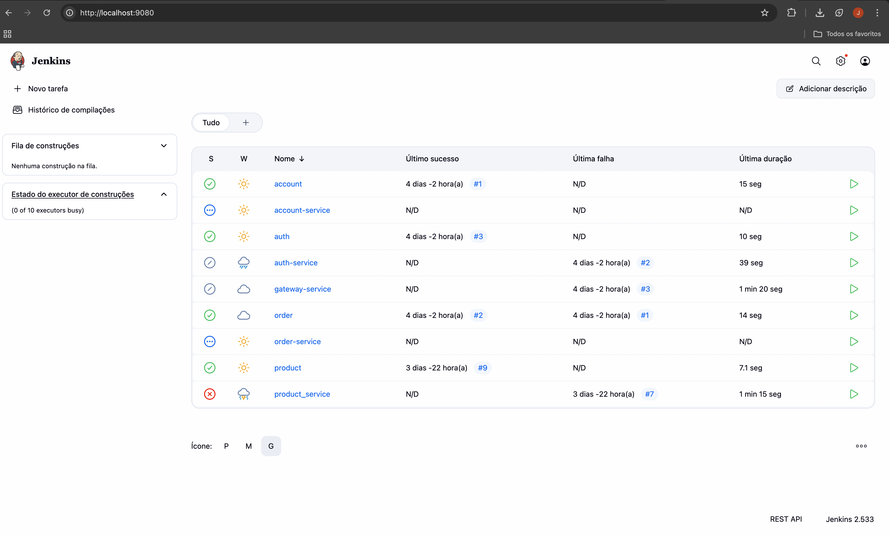

# Jenkins Pipeline Structure

Our Jenkins CI/CD pipeline is composed of four key stages:

1. **Checkout SCM** - Automatically clones the repository from GitHub
2. **Dependencies** - Installs all project dependencies using Maven
3. **Build** - Compiles and packages the application with Maven
4. **Build & Push Image** - Creates multi-architecture Docker images and pushes them to DockerHub


## Architecture Diagrams

=== "Jenkins"
    { width=100% }

    ### Microservice Pipeline

Each microservice contains a `Jenkinsfile` defining the CI/CD process:

```groovy
pipeline {
    agent any
    environment {
        SERVICE = 'product-service'
        NAME = "Joao-Gabriel05/${env.SERVICE}"
    }
    stages {
        stage('Dependencies') {
            steps {
                build job: 'product', wait: true
            }
        }
        stage('Build') { 
            steps {
                sh 'mvn -B -DskipTests clean package'
            }
        }      
        stage('Build & Push Image') {
            steps {
                withCredentials([usernamePassword(credentialsId: 'dockerhub-credential', usernameVariable: 'USERNAME', passwordVariable: 'TOKEN')]) {
                    sh "docker login -u $USERNAME -p $TOKEN"
                    sh "docker buildx create --use --platform=linux/arm64,linux/amd64 --node multi-platform-builder-${env.SERVICE} --name multi-platform-builder-${env.SERVICE}"
                    sh "docker buildx build --platform=linux/arm64,linux/amd64 --push --tag ${env.NAME}:latest --tag ${env.NAME}:${env.BUILD_ID} -f Dockerfile ."
                    sh "docker buildx rm --force multi-platform-builder-${env.SERVICE}"
                }
            }
        }
    }
}
```


### Contract Pipeline

Contracts use a simplified pipeline focused on building and installing the artifacts:

```groovy
pipeline {
    agent any

    stages {
        stage('Build') {
            steps {
                sh 'mvn -B -DskipTests clean install'
            }
        }
    }
}
```

> This MkDocs was created by [Joao Gabriel Faus Faraco](https://github.com/Joao-Gabriel05)