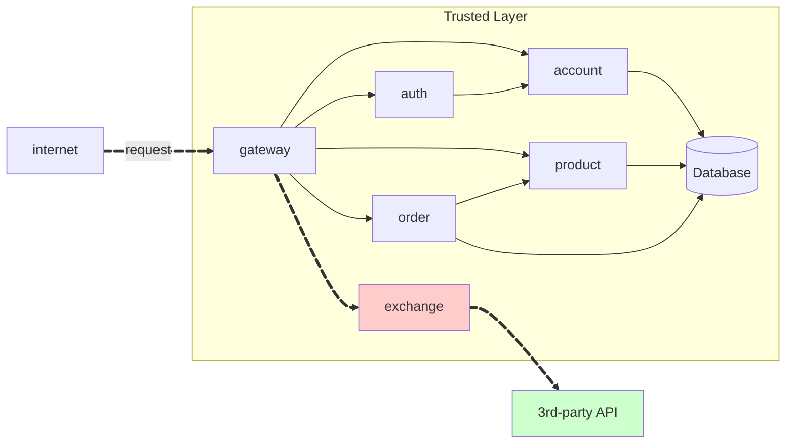
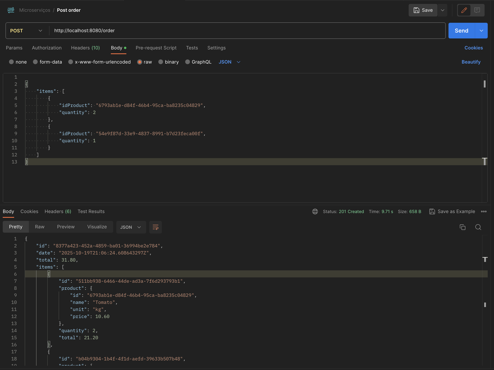
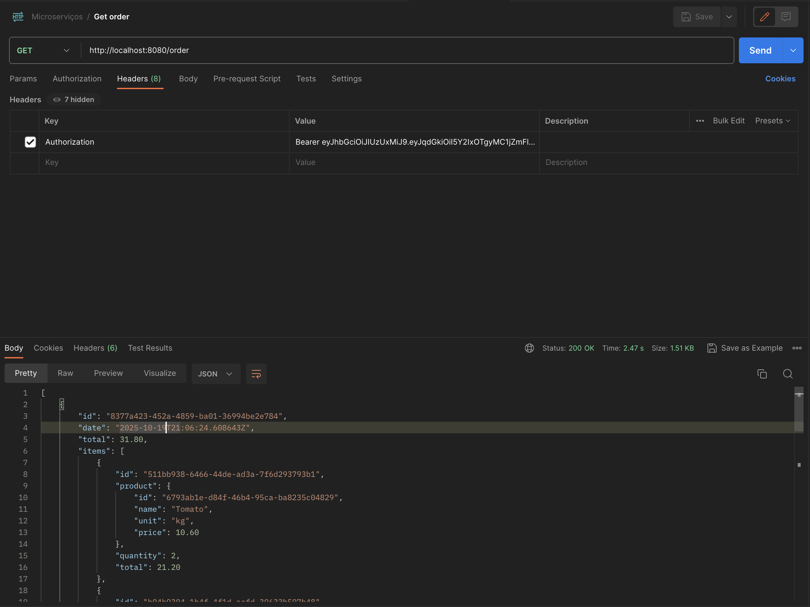
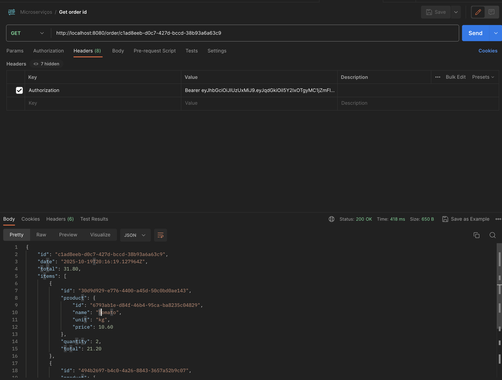

!!! warning "Attention"

    **To consume the API, the user must be authenticated.**

## Order Service

Github repository: [Order Service](https://github.com/Joao-Gabriel05/order-service)

```bash
order/
├── OrderApplication.java
├── OrderItemModel.java
├── OrderMapper.java
├── OrderModel.java
├── OrderRepository.java
├── OrderResource.java
├── OrderService.java
```

## Order (contract)

Github repository: [Order](https://github.com/Joao-Gabriel05/order)

```bash
order/
├── ItemIn.java
├── ItemOut.java
├── OrderController.java
├── OrderIn.java
├── OrderOut.java
├── ProductSpanpshot.java
```


## Order API

!!! info "POST /order"

    Create a new order **for the current user**.

    === "Request"

        ``` { .json .copy .select linenums='1' }

        {
            "items": [
                {
                    "idProduct": "6793ab1e-d84f-46b4-95ca-ba8235c04829",
                    "quantity": 2
                },
                {
                    "idProduct": "54e9f87d-33e9-4837-8991-b7d23feca00f",
                    "quantity": 1
                }
            ]
        }
        ```

    === "Response"

        ``` { .json .copy .select linenums='1' }
        {
            "id": "8377a423-452a-4859-ba01-36994be2e784",
            "date": "2025-10-19T21:06:24.608643297Z",
            "total": 31.80,
            "items": [
                {
                    "id": "511bb938-6466-44de-ad3a-7f6d293793b1",
                    "product": {
                        "id": "6793ab1e-d84f-46b4-95ca-ba8235c04829",
                        "name": "Tomato",
                        "unit": "kg",
                        "price": 10.60
                    },
                    "quantity": 2,
                    "total": 21.20
                },
                {
                    "id": "b04b9304-1b4f-4f1d-aefd-39633b507b48",
                    "product": {
                        "id": "54e9f87d-33e9-4837-8991-b7d23feca00f",
                        "name": "Uva",
                        "unit": "kg",
                        "price": 10.60
                    },
                    "quantity": 1,
                    "total": 10.60
                }
            ]
        }
        ```
        ```bash
        Response code: 201 (created)
        Response code: 400 (bad request), if the product does not exist.
        ```

    === "Postman"
        { width=100% }

!!! info "GET /order"

    Get all orders **for the current user**.

    === "Response"

        ``` { .json .copy .select linenums='1' }
        [
            {
                "id": "8377a423-452a-4859-ba01-36994be2e784",
                "date": "2025-10-19T21:06:24.608643Z",
                "total": 31.80,
                "items": [
                    {
                        "id": "511bb938-6466-44de-ad3a-7f6d293793b1",
                        "product": {
                            "id": "6793ab1e-d84f-46b4-95ca-ba8235c04829",
                            "name": "Tomato",
                            "unit": "kg",
                            "price": 10.60
                        },
                        "quantity": 2,
                        "total": 21.20
                    },
                    {
                        "id": "b04b9304-1b4f-4f1d-aefd-39633b507b48",
                        "product": {
                            "id": "54e9f87d-33e9-4837-8991-b7d23feca00f",
                            "name": "Uva",
                            "unit": "kg",
                            "price": 10.60
                        },
                        "quantity": 1,
                        "total": 10.60
                    }
                ]
            },
            {
                "id": "344c9a49-76ab-4b50-9710-8fc5be868b0f",
                "date": "2025-10-19T21:01:11.909389Z",
                "total": 31.80,
                "items": [
                    {
                        "id": "885631ec-b20c-4549-ae39-db8e0126bfec",
                        "product": {
                            "id": "6793ab1e-d84f-46b4-95ca-ba8235c04829",
                            "name": "Tomato",
                            "unit": "kg",
                            "price": 10.60
                        },
                        "quantity": 2,
                        "total": 21.20
                    },
                    {
                        "id": "94adaa6e-7e32-499c-85da-0c26bbe6c6a6",
                        "product": {
                            "id": "54e9f87d-33e9-4837-8991-b7d23feca00f",
                            "name": "Uva",
                            "unit": "kg",
                            "price": 10.60
                        },
                        "quantity": 1,
                        "total": 10.60
                    }
                ]
            },
            {
                "id": "c1ad8eeb-d0c7-427d-bccd-38b93a6a63c9",
                "date": "2025-10-19T20:16:19.127964Z",
                "total": 31.80,
                "items": [
                    {
                        "id": "30d9d929-e776-4400-a45d-50c0bd0ae143",
                        "product": {
                            "id": "6793ab1e-d84f-46b4-95ca-ba8235c04829",
                            "name": "Tomato",
                            "unit": "kg",
                            "price": 10.60
                        },
                        "quantity": 2,
                        "total": 21.20
                    },
                    {
                        "id": "494b2697-b4c0-4a26-8843-3657a52b9c07",
                        "product": {
                            "id": "54e9f87d-33e9-4837-8991-b7d23feca00f",
                            "name": "Uva",
                            "unit": "kg",
                            "price": 10.60
                        },
                        "quantity": 1,
                        "total": 10.60
                    }
                ]
            }
        ]
        ```
        ```bash
        Response code: 200 (ok)
        ```
    === "Postman"
        { width=100% }

!!! info "GET /order/{id}"

    Get the order details by its ID. **The order must belong to the current user.**, otherwise, return a `404`.

    === "Response"

        ``` { .json .copy .select linenums='1' }
        {
            "id": "c1ad8eeb-d0c7-427d-bccd-38b93a6a63c9",
            "date": "2025-10-19T20:16:19.127964Z",
            "total": 31.80,
            "items": [
                {
                    "id": "30d9d929-e776-4400-a45d-50c0bd0ae143",
                    "product": {
                        "id": "6793ab1e-d84f-46b4-95ca-ba8235c04829",
                        "name": "Tomato",
                        "unit": "kg",
                        "price": 10.60
                    },
                    "quantity": 2,
                    "total": 21.20
                },
                {
                    "id": "494b2697-b4c0-4a26-8843-3657a52b9c07",
                    "product": {
                        "id": "54e9f87d-33e9-4837-8991-b7d23feca00f",
                        "name": "Uva",
                        "unit": "kg",
                        "price": 10.60
                    },
                    "quantity": 1,
                    "total": 10.60
                }
            ]
        }
        ```
        ```bash
        Response code: 200 (ok)
        Response code: 404 (not found), if the order does not belong to the current user.
        ```

    === "Postman"
        { width=100% }


> This MkDocs was created by [João Gabriel Faus Faraco](https://github.com/Joao-Gabriel05)