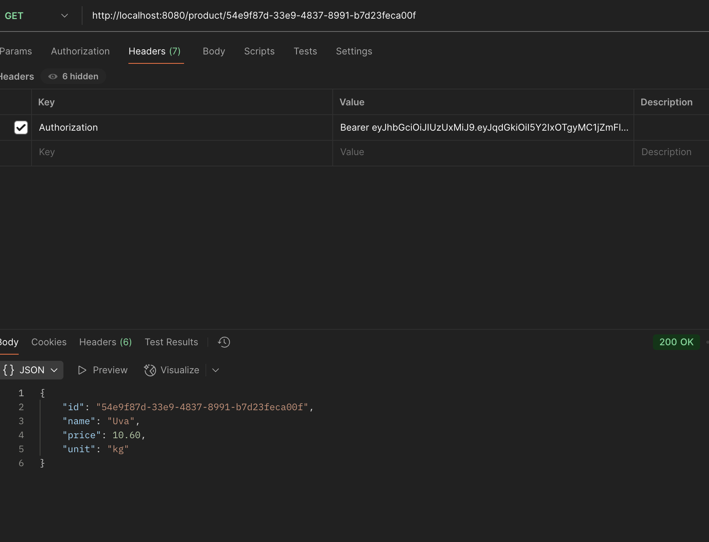

RESTful API for a store's `Product`.


!!! warning "Attention"

    **To consume the API, the user must be authenticated.**

## Product Service

Github repository: [Product Service](https://github.com/Joao-Gabriel05/product_service)

```bash
product/
├── Product.java
├── ProductApplication.java
├── ProductModel.java
├── ProductParser.java
├── ProductRepository.java
├── ProductResource.java
├── ProductService.java
```

## Product (contract)

Github repository: [Product](https://github.com/Joao-Gabriel05/product)

```bash
product/
├── ProductController.java
├── ProductIn.java
├── ProductOut.java
```

## Product API

The API has the following endpoints:

!!! info "POST /product"

    Create a new product.

    === "Request"

        ``` { .json .copy .select linenums='1' }
        {
            "name": "Caju",
            "price": 10.60,
            "unity": "kg"
        }
        ```

    === "Response"

        ``` { .json .copy .select linenums='1' }
        {
            "idProduct": "cd0a9077-6a9c-46a2-a5cd-8cef19a205e4",
            "name": "Caju",
            "price": 10.60,
            "unity": "kg"
        }
        ```
        ```bash
        Response code: 201 (created)
        ```
    === "Postman"
        { width=100% }


!!! info "GET /product"

    Get all products.

    === "Response"

        ``` { .json .copy .select linenums='1' }
        [
            {
                "id": "6793ab1e-d84f-46b4-95ca-ba8235c04829",
                "name": "Tomato",
                "price": 10.60,
                "unit": "kg"
            },
            {
                "id": "54e9f87d-33e9-4837-8991-b7d23feca00f",
                "name": "Uva",
                "price": 10.60,
                "unit": "kg"
            },
            {
                "id": "97172619-f825-4755-93dd-d60852820bfd",
                "name": "Suco",
                "price": 10.60,
                "unit": "kg"
            },
            {
                "id": "cd0a9077-6a9c-46a2-a5cd-8cef19a205e4",
                "name": "Caju",
                "price": 10.60,
                "unit": "kg"
            }
        ]
        ```
        ```bash
        Response code: 200 (ok)
        ```
    === "Postman"
        { width=100% }

!!! info "GET /product/{id}"

    Get a product by its ID.

    === "Response"

        ``` { .json .copy .select linenums='1' }
        {
            "id": "54e9f87d-33e9-4837-8991-b7d23feca00f",
            "name": "Uva",
            "price": 10.60,
            "unit": "kg"
        }
        ```
        ```bash
        Response code: 200 (ok)
        ```

    === "Postman"

        { width=100% }


!!! info "DELETE /product/{id}"

    Delete a product by its ID.

    === "Response"

        ```bash
        Response code: 204 (no content)
        ```

    === "Postman"
        { width=100% }


> This MkDocs was created by [João Gabriel Faus Faraco](https://github.com/Joao-Gabriel05)